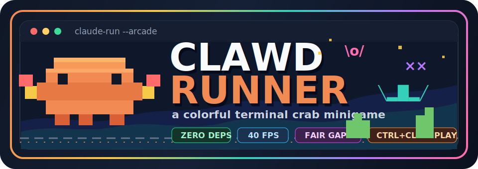
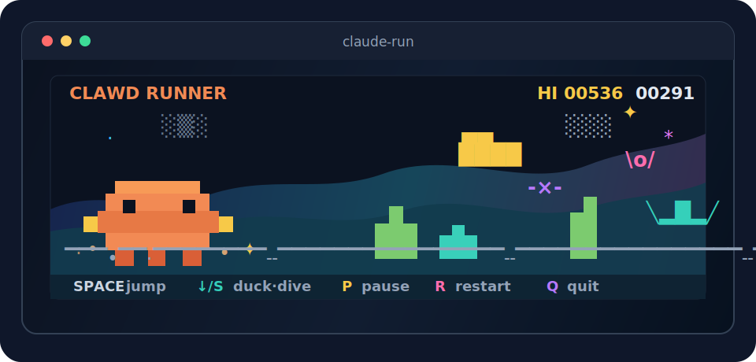

<p align="center">
  
</p>

# Clawd Runner 🦀

**Clawd Runner** — the Chrome-dino game, but it's Clawd (the Claude Code crab) dodging
segfault cacti and flying bugs in your terminal. Ctrl+click the crab in your Claude Code
statusline and the game pops open in a new window, like the dino when the wifi dies —
except your wifi is fine and you're just procrastinating.

<p align="center">
  
</p>

Zero dependencies. ~40 fps of pure-string rendering. Parallax dunes + drifting clouds,
a day/night cycle with a sun, a moon and shooting stars. A square, pixel-traced Clawd
with eight kinds of segfault-cactus, three flying enemies, dust kick-up, landing puffs
and a death screen-shake. Procedural gaps that are always *fair* — and a high score.

## Play

```sh
git clone https://github.com/<you>/claude-minigame
cd claude-minigame
npm link        # puts `claude-run` on your PATH
claude-run
```

`clawd run` still works as a legacy alias.

| key | action |
| --- | --- |
| `SPACE` / `↑` / `W` | jump |
| `↓` / `S` | duck under mid flyers — **tap in mid-air to dive** (fast-fall) |
| `P` | pause |
| `R` | restart |
| `Q` / `ESC` | quit |

Score is distance. Speed ramps up smoothly (no sudden walls), and the gap before every
obstacle is sized so it's always clearable — combos and tall cacti get extra room. Enemies
start flying at you around 110 — wings flapping, beating in *faster* than the ground
scrolls — coming low (jump), mid (duck) or as a rare 5-wide bird, and they'll never
stack onto a cactus so you're never asked to jump and duck at once. Night falls every
480 points, with stars and the odd shooting star. Jumps have a
landing-buffer so a slightly-early press still hops. That's it, that's the game.

## Make Clawd clickable in Claude Code

This is the whole point, so here's how the trick works: modern terminals (Windows
Terminal, iTerm2, kitty, WezTerm…) support **OSC 8 hyperlinks** — escape sequences
that turn any printed text into a ctrl+clickable link. Links don't have to be
`https://`: they can be any registered URL scheme. So:

1. **Register the `clawd://` protocol** so your OS knows clicking it launches the game.

   Windows (no admin needed, writes only HKCU):
   ```powershell
   powershell -ExecutionPolicy Bypass -File tools\install-protocol.ps1
   ```
   Test it: `start clawd://play` → the game opens in a new terminal window.

   macOS/Linux: not wired up yet — PRs very welcome (`duti`/Info.plist on macOS,
   `xdg-mime` + a .desktop file on Linux).

2. **Put a linked crab in your Claude Code statusline.**

   No statusline yet? Point `~/.claude/settings.json` at the one included here:
   ```json
   "statusLine": { "type": "command", "command": "node <ABS PATH>/tools/statusline-basic.js" }
   ```

   Already have one? Splice these three lines into it:
   ```js
   const ORANGE = '\x1b[38;2;217;119;87m', DIM = '\x1b[2m', RESET = '\x1b[0m';
   const link = (t, u) => '\x1b]8;;' + u + '\x07' + t + '\x1b]8;;\x07';
   out += '  ' + link(ORANGE + '▐▛▜▌' + RESET + DIM + ' play' + RESET, 'clawd://play');
   ```

3. Ctrl+click the `▐▛▜▌ play` at the bottom of any Claude Code session. Your terminal
   may ask permission to open an external app the first time — that's the OS being
   sensible about custom protocols. Allow it, and Clawd scuttles.

## Why not the actual welcome-screen mascot?

We tried. As of 2026, Claude Code ships as a compiled binary on every install path —
the native installer *and* the npm package both deliver a platform executable, so
there's no `cli.js` to politely wrap a hyperlink around anymore. Patching the sprite
inside a 244 MB binary means proper executable repacking (see how
[tweakcc](https://github.com/Piebald-AI/tweakcc) does it with node-lief — that's the
prior art if you want to attempt it). The statusline is the officially supported,
update-proof surface, and it has a bonus: the crab is clickable **all session long**,
not just at startup.

## Uninstall

```powershell
powershell -ExecutionPolicy Bypass -File tools\install-protocol.ps1 -Uninstall
npm unlink -g claude-minigame
```
…and remove the crab lines from your statusline. High scores live in
`~/.claude-minigame.json` if you want to scrub the evidence.

## Development

```sh
npm test                 # headless engine tests (physics, collisions, rendering)
npm run snapshot         # render bot-played frames as plain text (debugging/CI)
node bin/clawd.js run --seed 7   # deterministic runs
```

The engine (`src/engine.js`) is pure simulation — no terminal I/O — so it's easy to
test and easy to port. `bin/clawd.js` owns the screen and keyboard.

## Credits

Clawd is [the unofficial mascot of Claude Code](https://github.com/anthropics/claude-code/issues/8536),
by Anthropic. This is a fan project, not affiliated with or endorsed by Anthropic —
the sprite is a hand-made block-character homage. Inspired by Chrome's `chrome://dino`,
the patron saint of lost connectivity.

MIT, see [LICENSE](LICENSE). Vibecoded with Claude Code, naturally.
